# 1. 概述

LangChain 中的 Memory 系统用于在对话和链式调用中维护状态。Memory 可以存储关于过去执行的信息，并将这些信息注入到未来执行的输入中。这对于构建连贯的对话系统尤其重要。

需要注意的是，当前版本的 Memory 系统已被标记为废弃，将在 LangChain 1.0.0 版本中移除。官方推荐使用新的状态管理方式。

# 2. Memory 类型层次结构

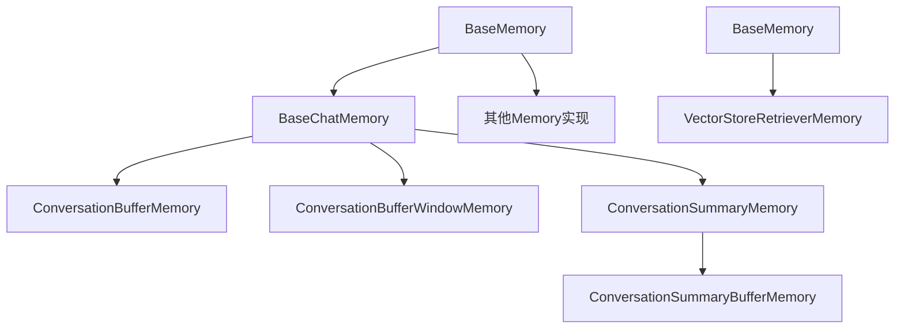

# 3. 各 Memory 类型详细对比

## 3.1 BaseMemory (基础内存类)

文件路径: [libs/core/langchain_core/memory.py](https://github.com/langchain-ai/langchain/blob/master/libs/core/langchain_core/memory.py)

| 特性     | 说明                                                         |
| -------- | ------------------------------------------------------------ |
| 类型     | 抽象基类                                                     |
| 状态     | 已废弃 (since 0.3.3)                                         |
| 主要方法 | memory_variables, load_memory_variables, save_context, clear |
| 用途     | 所有 Memory 类型的基类                                       |

核心抽象方法:

- memory_variables: 返回内存变量的键列表
- load_memory_variables: 加载内存变量
- save_context: 保存上下文
- clear: 清除内存内容

## 3.2 BaseChatMemory (基础聊天内存类)

文件路径: [libs/langchain/langchain/memory/chat_memory.py](https://github.com/langchain-ai/langchain/blob/master/libs/langchain/langchain/memory/chat_memory.py)

| 特性     | 说明                                                |
| -------- | --------------------------------------------------- |
| 类型     | 抽象基类                                            |
| 状态     | 已废弃 (since 0.3.1)                                |
| 继承     | BaseMemory                                          |
| 主要属性 | chat_memory, output_key, input_key, return_messages |
| 用途     | 聊天相关 Memory 的基类                              |

核心特性:

- 使用 BaseChatMessageHistory 存储消息历史
- 提供 \_get_input_output 方法来提取输入输出
- 实现了 save_context 和 clear 方法

## 3.3 ConversationBufferMemory (对话缓冲内存)

文件路径: [libs/langchain/langchain/memory/buffer.py](https://github.com/langchain-ai/langchain/blob/master/libs/langchain/langchain/memory/buffer.py)

| 特性     | 说明                                |
| -------- | ----------------------------------- |
| 类型     | 具体实现类                          |
| 状态     | 已废弃 (since 0.3.1)                |
| 继承     | BaseChatMemory                      |
| 主要属性 | human_prefix, ai_prefix, memory_key |
| 缓冲区   | 存储完整对话历史                    |

核心特性:

- 存储完整的对话历史（所有消息）
- 可以以字符串或消息列表形式返回历史
- 通过 buffer, buffer_as_str, buffer_as_messages 属性访问历史

使用示例:

```python
from langchain.memory import ConversationBufferMemory

memory = ConversationBufferMemory()
memory.save_context({"input": "你好"}, {"output": "你好！有什么我可以帮你的吗？"})
memory.save_context({"input": "我想了解LangChain"}, {"output": "LangChain是一个用于构建LLM应用的框架"})
print(memory.load_memory_variables({}))
# 输出包含所有对话历史
```

图示说明:

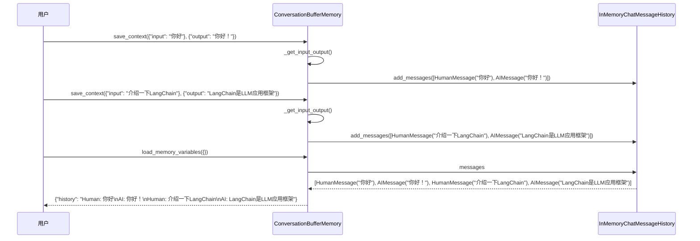

## 3.4 ConversationBufferWindowMemory (窗口对话缓冲内存)

文件路径: [libs/langchain/langchain/memory/buffer_window.py](https://github.com/langchain-ai/langchain/blob/master/libs/langchain/langchain/memory/buffer_window.py)

| 特性     | 说明                                   |
| -------- | -------------------------------------- |
| 类型     | 具体实现类                             |
| 状态     | 已废弃 (since 0.3.1)                   |
| 继承     | BaseChatMemory                         |
| 主要属性 | human_prefix, ai_prefix, memory_key, k |
| 缓冲区   | 存储最近 k 轮对话                      |

核心特性:

- 仅存储最近 k 轮对话（默认 5 轮）
- 通过 k 参数控制窗口大小
- 自动丢弃超出窗口的历史消息

使用示例:

```python
from langchain.memory import ConversationBufferWindowMemory

memory = ConversationBufferWindowMemory(k=2)  # 只保留最近2轮对话
memory.save_context({"input": "你好"}, {"output": "你好！"})
memory.save_context({"input": "介绍一下LangChain"}, {"output": "LangChain是LLM应用框架"})
memory.save_context({"input": "它有什么特性"}, {"output": "它提供了组件化、链式调用等功能"})
print(memory.load_memory_variables({}))
# 只输出最近2轮对话
```

图示说明:

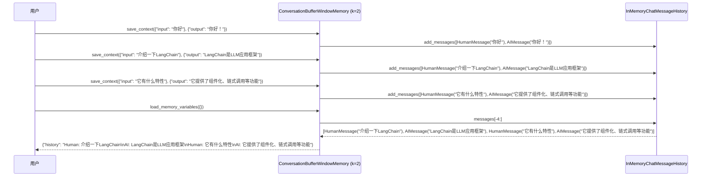

## 3.5 ConversationSummaryMemory (对话摘要内存)

文件路径: [libs/langchain/langchain/memory/summary.py](https://github.com/langchain-ai/langchain/blob/master/libs/langchain/langchain/memory/summary.py)

| 特性     | 说明                            |
| -------- | ------------------------------- |
| 类型     | 具体实现类                      |
| 状态     | 已废弃 (since 0.3.1)            |
| 继承     | BaseChatMemory, SummarizerMixin |
| 主要属性 | buffer, memory_key, llm, prompt |
| 缓冲区   | 存储对话摘要而非完整历史        |

核心特性:

- 使用 LLM 生成对话摘要
- 每次新增对话时更新摘要
- 节省内存和上下文长度
- 需要传入 LLM 实例用于生成摘要

使用示例:

```python
from langchain.memory import ConversationSummaryMemory
from langchain_openai import OpenAI

llm = OpenAI()
memory = ConversationSummaryMemory(llm=llm)
memory.save_context({"input": "你好"}, {"output": "你好！"})
memory.save_context({"input": "介绍一下LangChain"}, {"output": "LangChain是LLM应用框架"})
print(memory.load_memory_variables({}))
# 输出对话摘要而非完整历史
```

图示说明:

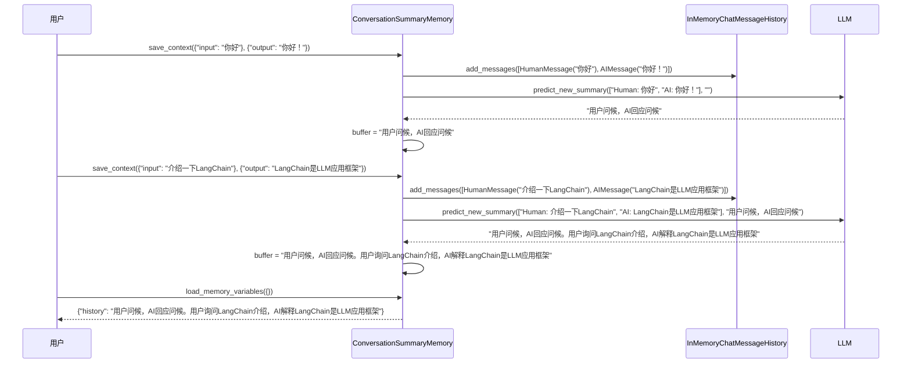

## 3.6 ConversationSummaryBufferMemory (摘要缓冲内存)

文件路径: [libs/langchain/langchain/memory/summary_buffer.py](https://github.com/langchain-ai/langchain/blob/master/libs/langchain/langchain/memory/summary_buffer.py)

| 特性     | 说明                                             |
| -------- | ------------------------------------------------ |
| 类型     | 具体实现类                                       |
| 状态     | 已废弃 (since 0.3.1)                             |
| 继承     | BaseChatMemory, SummarizerMixin                  |
| 主要属性 | buffer, memory_key, llm, prompt, max_token_limit |
| 缓冲区   | 结合完整历史和摘要                               |

核心特性:

- 结合了缓冲和摘要的优点
- 保留最近的完整消息，对旧消息进行摘要
- 通过 max_token_limit 控制内存使用
- 在内存和信息完整性之间取得平衡

使用示例:

```python
from langchain.memory import ConversationSummaryBufferMemory
from langchain_openai import OpenAI

llm = OpenAI()
memory = ConversationSummaryBufferMemory(llm=llm, max_token_limit=100)
# 使用方式与其它Memory类型类似
```

图示说明:

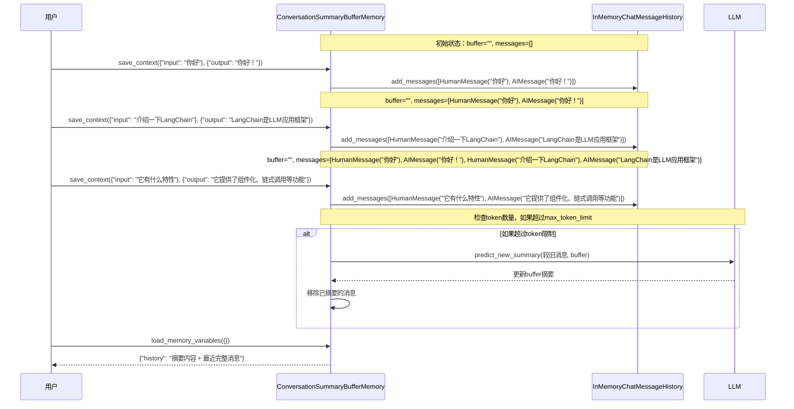

## 3.7 VectorStoreRetrieverMemory (向量存储检索内存)

文件路径: [libs/langchain/langchain/memory/vectorstore.py](https://github.com/langchain-ai/langchain/blob/master/libs/langchain/langchain/memory/vectorstore.py)

| 特性     | 说明                                          |
| -------- | --------------------------------------------- |
| 类型     | 具体实现类                                    |
| 状态     | 已废弃 (since 0.3.1)                          |
| 继承     | BaseMemory                                    |
| 主要属性 | retriever, memory_key, input_key, return_docs |
| 缓冲区   | 使用向量存储和检索机制                        |

核心特性:

- 使用向量存储保存对话历史
- 根据输入内容检索相关历史
- 适用于大规模对话历史场景
- 需要传入 VectorStoreRetriever 实例

使用示例:

```python
from langchain.memory import VectorStoreRetrieverMemory
from langchain.vectorstores import Chroma
from langchain_openai import OpenAIEmbeddings

embedding = OpenAIEmbeddings()
vectorstore = Chroma("langchain_store", embedding)
retriever = vectorstore.as_retriever()
memory = VectorStoreRetrieverMemory(retriever=retriever)
```

图示说明:

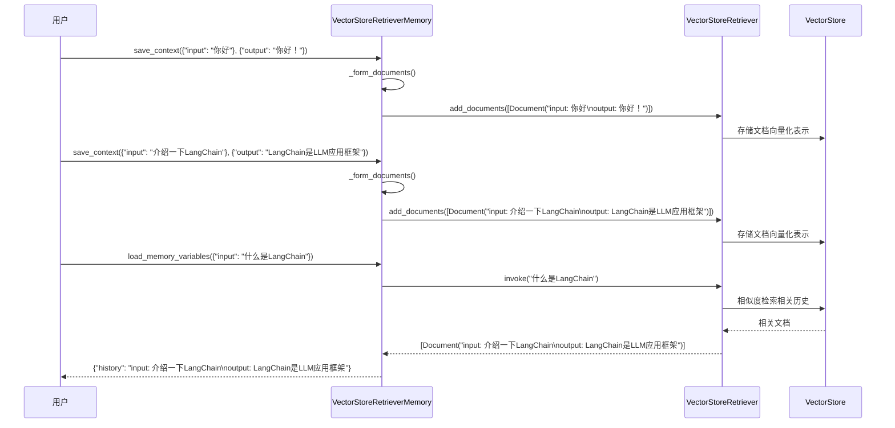

# 4. Memory 类型对比表

| 特性         | ConversationBufferMemory | ConversationBufferWindowMemory | ConversationSummaryMemory | ConversationSummaryBufferMemory | VectorStoreRetrieverMemory |
| ------------ | ------------------------ | ------------------------------ | ------------------------- | ------------------------------- | -------------------------- |
| 存储方式     | 完整历史                 | 固定窗口                       | 摘要                      | 混合(近期完整+历史摘要)         | 向量存储                   |
| 内存使用     | 高                       | 中等                           | 低                        | 中等                            | 取决于向量存储             |
| 上下文相关性 | 全部                     | 最近 K 轮                      | 摘要                      | 混合                            | 基于相似度检索             |
| 实现复杂度   | 简单                     | 简单                           | 复杂(需要 LLM)            | 复杂(需要 LLM)                  | 复杂(需要向量存储)         |
| 适用场景     | 短对话                   | 中等长度对话                   | 长对话                    | 长对话                          | 大规模对话历史             |
| 需要 LLM     | 否                       | 否                             | 是                        | 是                              | 否                         |
| 需要向量存储 | 否                       | 否                             | 否                        | 否                              | 是                         |

# 5. Memory 使用流程对比

## 5.1 ConversationBufferMemory 流程

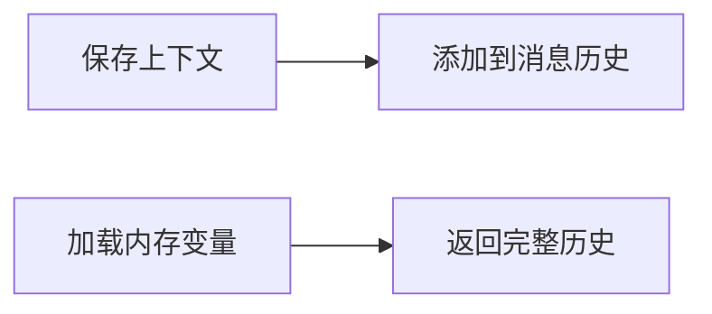

## 5.2 ConversationBufferWindowMemory 流程

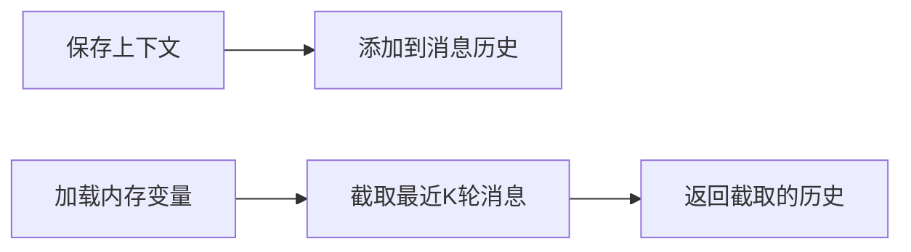

## 5.3 ConversationSummaryMemory 流程

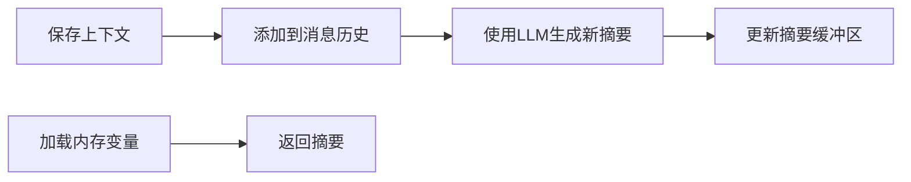

## 5.4 ConversationSummaryBufferMemory 流程

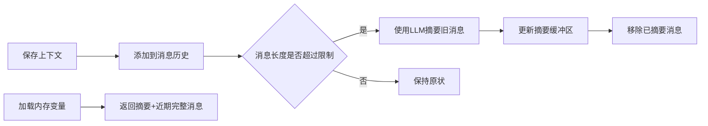

## 5.5 VectorStoreRetrieverMemory 流程

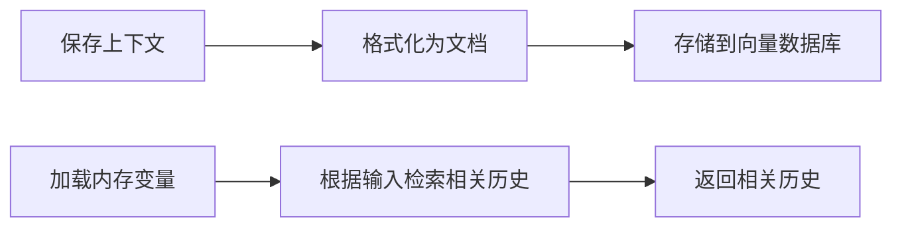

# 6. 使用建议

## 6.1 根据对话长度选择

1. **短对话** (< 10 轮) - 使用 ConversationBufferMemory

   - 简单直接
   - 保持完整的上下文信息

2. **中等长度对话** (10-50 轮) - 使用 ConversationBufferWindowMemory

   - 限制历史长度，节省内存
   - 保持近期上下文的完整性

3. **长对话** (> 50 轮) - 使用 ConversationSummaryBufferMemory
   - 平衡内存使用和上下文完整性
   - 保持近期完整信息和历史摘要

## 6.2 根据应用场景选择

1. **精确上下文要求** - 使用 ConversationBufferMemory 或 ConversationBufferWindowMemory

   - 适用于需要精确引用历史对话的场景

2. **大规模历史存储** - 使用 VectorStoreRetrieverMemory

   - 适用于需要存储大量历史且基于相关性检索的场景

3. **内存受限环境** - 使用 ConversationSummaryMemory
   - 适用于内存有限但需要保持长期记忆的场景

# 7. 迁移建议

由于所有 Memory 类型都已被标记为废弃，建议按照官方迁移指南进行迁移:

- 查看迁移指南: https://python.langchain.com/docs/versions/migrating_memory/
- 考虑使用 LangGraph 进行状态管理
- 使用新的聊天历史接口

新的推荐方式:

```python
# 使用新的聊天历史接口
from langchain_core.messages import HumanMessage, AIMessage
from langchain_core.chat_history import InMemoryChatMessageHistory

chat_history = InMemoryChatMessageHistory()
chat_history.add_message(HumanMessage(content="你好"))
chat_history.add_message(AIMessage(content="你好！有什么我可以帮你的吗？"))
```

# 8. 总结

LangChain 的 Memory 系统提供了多种管理对话历史的方式，每种方式都有其适用场景。虽然这些功能已被标记为废弃，但在当前版本中仍然可以使用。在新项目中，建议直接使用官方推荐的新方式来管理对话状态。

通过以上图示对比，可以更直观地理解各种 Memory 类型的工作原理和适用场景，有助于在实际项目中做出合适的选择。
