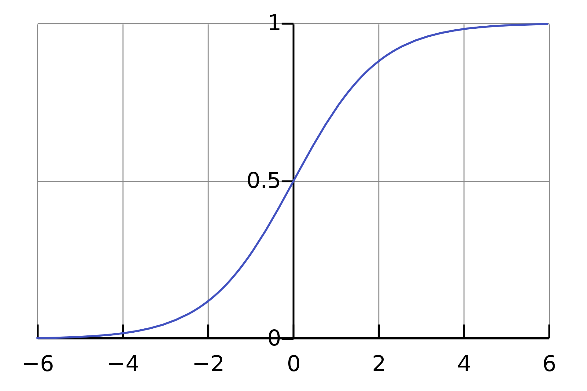
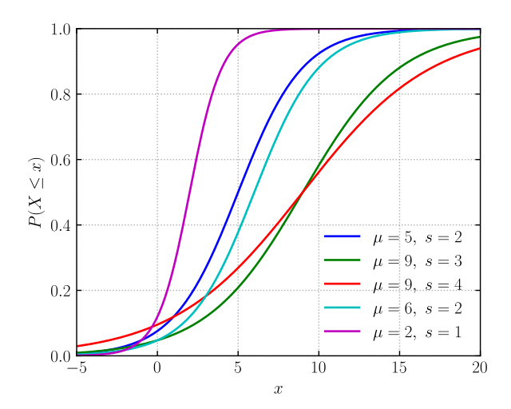
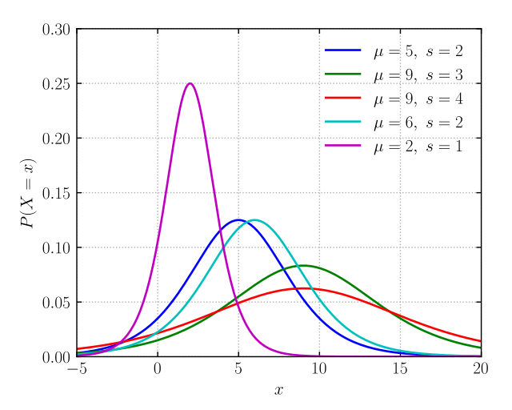

逻辑回归 (Logistic Regression, LR) 是一种经典的机器学习模型, 在很多机器学习任务(比如广告推荐, 推荐排序等)中, 都可以作为 baseline 模型使用.

从名字上看, LR 包含 Logistic 和 Regression 两个单词, 其中
* Logistic 源自 Logistic Distribution, LR 中使用 Logistic 分布建模分类概率
* Regression 源自 Linear Regression, LR 中的采用了回归的思路来建模分类问题

因此, LR 的两个单词完全概括了它的两个组成部分: 使用线性回归模型将特征转换成一个实数, 然后实用逻辑分布将该实数转换为分类概率. 

看到这里, 你是不是会想: 又有人要来水逻辑回归的博文了 ...

先别忙下结论, 逻辑回归只是我们这篇文章的引子, 我们在这篇文章中主要聊一聊 "逻辑" 这个词的前世今生.

# 逻辑回归中的“逻辑”

逻辑回归中有两个地方跟“逻辑“挂钩， 前面已经提到了逻辑分布（the Logistic Distribution）。

另一个地方是 logit。逻辑回归中的线性模型部分就是在建模事件发生的 logit.

logit 一般翻译为 ”对数比， 对数几率“。1944年 Joseph Berkson 在创造这个术语时，恐怕同时受到了 logarithm (对数) 和 logistic function (逻辑函数) 的双重影响。
不管怎样，logit、logistic、logarith 应该都跟 logic 是同根词，大家都源自词根 [log-](https://membean.com/roots/log-word)。

从数学上讲，概率 p 的 logit 是其 odds 的对数。 odds 一般翻译为 ”几率", 它的英文解释是 "the probability (= how likely it is) that a particular thing will or will not happen",即 一个事件发生和不发生的比率。 
不过英文解释中的 probability 并不满足 probability 在数学上的定义，因为 odds 值域是非负实数域 $\displaystyle \mathbf{R}^{*}$, 而不是 `[0, 1]` 这个闭区间.

我们用数学语言重新描述一下上面的解释。对于二分类任务，LR 将样本 $\boldsymbol{x}$ 被划分为正类的概率建模如下：

$$
P(Y=1|\boldsymbol{x}) = \frac{1}{1 + e^{-\boldsymbol{Wx}}}
$$

其中 $\boldsymbol{W}$ 是需要学习的参数. 这里用到了 Logistic Function，是 LR 中 Logistic 一词的由来。

该样本被划分为正类的 odds 则可以表示如下:

$$
\begin{aligned}
\text{odds} (\boldsymbol{x}) &= \frac{P(Y=1| \boldsymbol{x})}{P(Y=0|\boldsymbol{x})} \\
               &= e^{\boldsymbol{Wx}}
\end{aligned}
$$

因此其 logit 为:

$$
\begin{aligned}
\text{logit}(\boldsymbol{x}) &= \log \text{odds} (\boldsymbol{x}) \\
                             &= \boldsymbol{Wx}
\end{aligned}
$$

logit 最终可以表示成样本特征 $\boldsymbol{x}$ 的线性回归（Linear Regression）模型，这是 LR 中 Regression 一词的由来。

在后面的章节中，我将详细介绍 LR 中各种 ”逻辑“ 的详细的来龙去脉。

# "逻辑" 词源

首先看一下 "逻辑" 这个中文词的来源。

中文词 "逻辑" 是一个外来词, 由中国清末翻译家严复先生所创, 它是对英文词 **logic** 的音译. 

"逻辑"一词后由中国传入日本, 读作 ロジック。 但在日语中则注明只是对Logic的注音，Logic在日语中的正式汉语翻译词为“论理”（ろんり）。

logic 还有一个很好的意译："理则"，这是由孙中山先生所译。孙中山先生[《建国方略.以作文为证》](http://www.sunyat-sen.org/index.php?m=content&c=index&a=show&catid=46&id=6662)中：“然则逻辑究为何物？当译以何名而后妥……吾以为当译之为‘理则’者也……学者之对于理则之学，则大都如陶渊明之读书，不求甚解而已。”

现代汉语中，"逻辑" 有四种常见含义:
1. 指客观事物的规律。例如：“历史的逻辑决定了人类社会讲一直向前发展”
2. 指某种特殊的理论、观点或看问题的方法。例如：“侵略者奉行的是强盗逻辑”
3. 指思维的规律、规则。例如：“写文章要讲逻辑”
4. 指逻辑学这门科学。例如：“大学生要学点逻辑”

# logic 的含义

前面讲到，中文词 ”逻辑“ 是英文单词 ”logic“ 的音译。 我们再详细探究一下英文词 ”logic“ 的含义和来源。

柯林斯词典对 logic 给出了三个解释:

*  **Logic** is a method of reasoning that involves **a series of statements**, each of which must be true if the statement before it is true. 逻辑 (学)
*  The **logic** of a conclusion or an argument is **its quality of being correct and reasonable**. (结论或观点的) 逻辑
   *  eg. I don't follow the logic of your argument.
*  A particular kind of **logic** is the way of thinking and reasoning about things that is characteristic of a particular type of person or particular field of activity. (某种人或某行为领域的) 逻辑
   *  eg. The plan was based on sound commercial logic.  (商业逻辑)

logic 从词源上看,
> * mid-14c., **logike**, "branch of philosophy that treats of forms of thinking; the science of distinction of true from false reasoning," 
> * from Old French **logique** (13c.), 
> * from Latin **(ars)logica** "logic," 
> * from Greek **(he)logike (techne)**  "(the) reasoning (art)," 
> * from fem. of **logikos** "pertaining to speaking or reasoning" (also "of or pertaining to speech"), 
> * from **logos** "reason, idea, word" (see Logos). 
> * Formerly also **logick**. 
> 
> Sometimes formerly plural, as in ethics, but this is not usual. 
> * Meaning "logical argumentation" is from c. 1600. Contemptuous logic-chopper "sophist, person who uses subtle distinctions in argument" is from 1846.

# Logistic 函数

此处主要参考 [Wikipedia: Logistic function](https://en.wikipedia.org/wiki/Logistic_function).

Logistic Function 是比利时数学家 [Pierre François Verhulst](https://en.wikipedia.org/wiki/Pierre_Fran%C3%A7ois_Verhulst)在 1938 ~ 1947 的三篇论文中提出的, 其目的是通过调整指数增长模型, 对人口增长函数进行建模. Logistic 很好的解释了人口增长模型的三个阶段:
- 指数增长阶段: 在初始阶段, 人口呈现几何增长趋势
- 线性增长阶段: 随着逐渐饱和, 增长曲线放缓至线性增长
- 滞胀阶段: 在成熟阶段, 人口停止增长

你可以从 Logistic 函数的函数图像上获得更直观的感受.

Verhulst 在 30 年代设计了该函数, 并于 1938 年发表了一个简短说明; 1944年进一步分析了该函数, 并给出正式命名 (对应论文则是 1845 年发表的).

> **Logistic 函数名字由来**
> Verhulst 在1945年发表的论文中将该曲线命名为 **logistic**, 但是并没有解释原因. 从这一点上看,Verhulst 实在不讲逻辑了 (a pun) !
> 参考 [Quora: How did "logistic equation" get its name?](https://www.quora.com/How-did-a-%E2%80%9Clogistic-equation%E2%80%9D-get-its-name-Does-logistic-mean-logical-or-logistic-work)

Logistic 函数的数学表达式如下

$$
f(x) = \frac{L}{1 + e ^ {-k (x - x_0)}}
$$

其中, 
- $x_0$ 是 S 曲线的中点 (mid-point)
- $L$ 是曲线的最大值
- $k$ 为曲线的增长率 (或成为陡度)

当 $x_0 = 0, L = 1, k = 1$ 时, 称之为 **标准逻辑函数** (Standard Logistic Function), 其表达式及函数图像如下:

$$
f(x) = \frac{1}{1 + e^{-x}}
$$

# logistic 词源探秘: 一些有趣的小知识

前面提到, logistic function 中 logistic 是 Verhulst 命名的, 并且并没有给出使用 "logistic" 一词的理由.

logistic 函数到底跟 logistic 的本义有什么联系呢? 能不能从 logistic 的本义上引申出 logistic 函数的某些性质呢?

我们带着疑问, 查一下 logistic 的本义。以下是柯林斯大词典给出的解释:

> ADJ. **Logistic** or **logistical** means relating to the organization of something complicated. "物流的, 后勤的"
> eg.
> 1. Logistical problems may be causing the delay. 物流问题可能会造成延期
> 2. She described the distribution of food and medical supplies as a logistical nightmare. 她将食品和医疗用品的分发描述为后勤噩梦。

咦? 怎么跟 "物流, 后勤" 扯上关系了? 再查!

下面是剑桥英汉词典给出的解释:
> ADJ. relating to the careful organization of a complicated activity. "后勤的"
> egs.
> 1. logistical support / problems, 后勤支持 / 问题
> 2. Assigning an armed federal officer to every commercial flight would be a logistical nightmare. 为每一次民用航班配备一名武装联邦军人将是一场后勤噩梦。

等等, 我们不是在搞 "逻辑" 吗? 咋跟 后勤和物流杠上了？”逻辑" 哪去了?

柯林斯词典还给出了一些其它解释:
> 1. N. an uninterpreted calculus or system of symbolic logic Compare formal language
> 2. ADJ, mathematics. (of a curve) having an equation of the form $y = k / (1 + e^{a + bx})$, where $b$ is less than zero
> 3. ADJ, rare. of, relating to, or skilled in arithmetical calculations. 
> 
> **Word origin**
> C17: via French, from Late Latin logisticus of calculation, from Greek logistikos rational, from logos word, reason

对于这些解释, 我的个人观点是: 这恐怕是 Verhulst 的 logistic function 这只鸡下的蛋呀!

既然都查了这么多了, 我们还是有始有终, 完整的查一下 logistic 这个词的词源关系和构词结构吧.

## logistic 词源

logistic, 也可以写作 logistical, 是一个形容词, 其含义是 "relating to the **careful** organization of a **complicated** activity", 中文解释为 "后勤的".

logistic 从词源上看,
> * "pertaining to logic," 1620s, from Medieval Latin **logisticus**, 
> * from Greek **logistikos** "skilled in calculating; endued with reason," from logistes "a calculator," 
> * from **logos** "calculation, proportion" (see Logos). 
> 
> Related: Logistical (1560s); logistically. 
> 
> **Logistics**, from this word, in the sense "art of arithmetical calculation" is from 1650s.

logistic 从构词上看, `log- + -istic`, 由词根 `log-` (表示 "说话", 引申为 "学说") 和 形容词后缀 `-istic` (表示 "...的").  `-istic` 是一个符合后缀, 由 `-ist + -ic` 构成.

## `log-` 词根

`log-` 词根表示 "说话, 推理, 计算", 源自希腊词汇 log (means "word"), 引申为 "学说" (常用词根 `-logy` 表示 (means "study of"), 如 biology, mythology).

源于该词根的单词示例如下:
* log: book of "words", 日记, 日志
* catalog: listing of "words", 目录
* dialogue: "words" between people, 对话
* monologue: "words" of one person, 独白
* prologue: "words" beforehand, 前言, 开场白, 引子, 序
* epilogue: after "words", 收场白, 后记, 跋
* logophile: "words" lover, 爱好词语的人
* logprrhea: "word" diarrhea, 多言症, 速语癖
* biology: "study" of life, 生物学
* zoology: "study" of animals, 动物学
* etymology: "study" of the origin of words, 词源学
* genealogy: "study" of one's family history, 家谱(学), 宗谱(学)

logic 虽然与 logistic 属于同根词, 但是其相对于词根 `log-` 的本意已经相去甚远了.

## Logistics, 物流 / 后勤

我们回过头来看 logistic 的本义吧.

前面提到, logistic 的本义是 "relating to the organization of something complicated", 中文一般翻译为 "物流的, 后勤的".

Logistic 有个复数名词形式: logistics, 其英文含义是 "the careful organization of a complicated activity so that it happens in a successful and effective way", 中文翻译为 "后勤, 物流; 物流学, 后勤学". 

中文词 "后勤" 还是从日语借过来的. 

鉴于中国和日本的一千多年的文化交流和恩怨纠葛, 现代汉语中有大量的日语借词, 比如 xx主义 / 萝莉 / 便当 / 经济 / 世界, 等等.

> **日语借词**
> 汉语中的日语借词指汉语由日语引入的借词。是华语圈与日语圈之间语言交流的一部分。汉语从日本借用辞汇发生在近代，主要以汉字为媒介。日语借词对现代汉语的形成有重要的作用。
> 具体来讲, 现代汉语中的日语借词有如下几类:
> 1. **和制汉语,** 又称“日源汉词”、“和来语”，是指现代汉语中从日语借用的新词。它又分为如下三种类型:
>       - 日本自制汉语词, 如: 电话, 干部, 艺术, 肯定, 否定, 假设, 直接, 海拔, 航空母舰 等
>       - 源自汉语,但被日本人赋予新意的汉语词, 如: 社会, 经济 等. (一些学者称之为 "回归词")
>       - 汉语古已有之, 且在日语中意义变化不大, 这一类可以认为不属于日语借词, 但常被人误以为来自日语。如：革命、政府、封建、科学、纪律 等 
> 2. **来源于 "宛字" 的词**，“宛字”，日语“当て字／宛て字”。日语传统上多用汉字，有时非汉语词也利用汉字的读音（音读与训读皆可能用到）以汉字纪录，如“滅茶苦茶（めちゃくちゃ）”。这种做法类似于六书的假借，但为区别于中国的假借，本文称之为“宛字”。分为两类：
>       - 来源于和语宛字的词，较少，例如：寿司（すし）
>       - 来源于外来语宛字的词，如：クラブ“倶乐部”、ロマン“浪漫”、ガス“瓦斯”、コンクリート“混凝土”、リンパ“淋巴”等
> 3. **和语词以汉字写法引入**，绝大部分的和语的人名、地名等专有名词是以汉字写法而非读音直接引入汉语。部分一般辞汇亦以汉字写法直接引入汉语，如：取消(取り消し)、场合(ばあい)、立场(たちば)、手续(てつづき)、出口(でぐち)、入口(いりぐち)、取缔(とりしまり)、见习(みならい)等
> 4. **日语自身读法的音译**，此类词汇多是日语本身非以汉字表达的词汇，但华人习惯于以汉字引入日本辞汇（包括专有名词），所以以音译方式输入了若干日本词。如“卡拉OK”（カラオケ），“榻榻米”（畳）等。商标的例子较多，如“马自达”（マツダ，松田）、“日产”的俗名“尼桑”、“立邦漆”（Nippon Paint）等。
> 5. **流通于台湾的日语借词**，如“便当（弁当）”、“欧巴桑（おばさん）”、“秀逗（ショート）”。不少在战后已被国语词汇取代并以台语读之。但现今尚有“水道水 tsuí-tō-tsuí（自来水）”、“注射 tsù-siā（打针）”、“注文 tsù-bûn（订购）”、“案内 àn-nāi（带路）”、“看板 khang-pang（招牌）”，甚至外来语如“oo-tó-bái（オートバイ，摩托车）”、“bì-lù（ビール，啤酒）”、“jiàn-bà（ジャンパー，夹克）”、和语如“a-sá-lih（あっさり，果断）”“oo-bá-sáng（おばさん，阿姨）”“sa-sí-mih（刺身，生鱼片）”
> 6. **日本流行文化引进的和制汉语**，如 声优、女优、攻略、暴走、援交、人气等
>
> 更多信息可以参考 [汉语中的日语借词](https://zh.wikipedia.org/zh-sg/%E6%BC%A2%E8%AA%9E%E4%B8%AD%E7%9A%84%E6%97%A5%E8%AA%9E%E5%80%9F%E8%A9%9E) 以及 [知乎: 日语借词为何在现代汉语中大行其道](https://zhuanlan.zhihu.com/p/419407308).

### “物流” 中的 “逻辑”

以下内容来自 [英文维基百科: Logistics](https://en.wikipedia.org/wiki/Logistics) 和 [中文维基百科: 物流](https://zh.wikipedia.org/wiki/%E7%89%A9%E6%B5%81).

**物流（英语：Logistics）**，是军事领域后勤概念的民间用语。

在西方该词语源于希腊语：λογιστικός, Logistikos，意为“计数科学”或“精于算计”。

“物流”是一套通过计算、策划来控制原材料、制成品、产成品或信息在供、需、仓储不同部之间转运的管理系统。“物流”或也可详称为其最终目的之“策略性物流运输”或“策运”。物质资料从供给者到需求者的物理运动，是创造时间价值、场所价值和一定的加工价值的活动。物流是指物质实体从供应者向需求者的物理移动，它由一系列创造时间价值和空间价值的经济活动组成，包括运输、保管、配送、包装、装卸、流通加工及处理等多项基本活动，是这些活动的统一。

相关概念最早出现于军事行政组织，在中国古代一直被称为辎重，后来在近代被逐渐改为后勤。

现代的“物流”概念最早可能是以在二战中，围绕战争物资供应，美军创建的后勤理论为原型的。当时的「后勤」是指将战时物资生产、采购、运输、配给等活动作为一个整体进行统一布置，以求战略物资补给的费用更低、速度更快、服务更好。后来，将“后勤”体系移植到现代经济生活中，才逐步演变为今天的物流。物流系统也可像互联网般，促进全球化。在贸易上，若要更进一步与世界连系，就得靠良好的物流管理系统。

市场上的商品很多是「游历」各国后才来到的。原料可能来自马来西亚和泰国，加工可能在新加坡，生产却在中国，最后才入口到美国。产品的「游历」路线就是由物流师计划、组织、指挥、协调、控制和监督，使各项物流活动实现最佳的协调与配合，以实现产品物流的目标，目标可能是：降低物流成本（cost），提高物流效率及质量（efficiency & quality），或提高物流的供应满足性（availability）。目标可能会有取舍和侧重。

### logistics 词源

Logistics 是 logistic 的复数名词，从词源关系上看，两者也略有不同。
> * "art of moving, quartering, and supplying troops," 1846, 
> * from French **(l'art)logistique** "(art) of quartering troops,", which apparently(据说) is 
>   - from **logis** "lodging" 
>       - from Old French **logeiz** "shelter for an army, encampment," from loge
>   - Greek-derived suffix **-istique** (see -istic). 
> * The form in French was influenced by **logistique**, from the Latin source of English logistic. 

# Logistic 分布

当我们限定 $L = 1$ 时, Logistic 函数是一条值域为 `(0, 1)` 的单调递增 S 曲线. 它实际上是 Logistic 分布的 累积分布函数 (Cumulative Distribution Function, CDF). 

Logistic 分布的 累积分布函数 及 概率密度函数 的数学表达式 和 函数图像吐下:

$$
\begin{aligned}
F(x; \mu, s) &= \frac{1}{1 + e^{-(x - \mu) / s}} \\
f(x; 0, 1) &= \frac{e^{-x}}{(1 + e^{-x})^2} \\
           &= F(x; 0, 1) [1 - F(x; 0, 1)]
\end{aligned}
$$

Logistic 分布的概率密度函数图像与正态分布相似, 但长尾分布更明显.

# logit

从语义上讲, logit 是本文讨论的词语中离 "逻辑" 最远的词；但从字形上看，logit 与 logic 最相似。 我们把它放到最后来讲。

logit 是 Joseph Berkson 在 1944 年创造的一个词, 它是由 logistic + unit 构成的一个.

关于定义该术语的理由，作者的原话如下:
>  “I use this term **logit** for $\displaystyle \ln p/q$ following Bliss, who called the analogous function which is linear on $\displaystyle x$ for the normal curve ‘probit.’”

简单而言，logit 是类比 probit 创造出的一个词语. 如果非要给 logit 一个定义
* (mathematics) the logit function is the inverse of the sigmoid (logistic) function. 
$$
\text{logit} (p) = \log (\frac{p}{1-p})
$$

在统计学上, $\frac{p}{1-p}$ 也有专门的术语表示, 称之为 **odds**, 一般翻译为 "发生比, 胜算, 几率", 所以 logit 有时也翻译成 **对数比** 或 **对数几率**.

> **probit**
> probit 是 Bliss 在 1934 年的论文 "The method if probits" 中创造的词语, 它有两个含义:
> * (statistics) A unit, derived from a standard distribution, used in measuring the response to doses
> * The probit function is the inverse of the cumulative distribution function
> 
> probit 有时会翻译成 "概率单位"。在概率与统计学中，概率单位是与标准正态分布相关联的分位函数；在数学上，概率单位是标准正态分布的累积分布函数的反函数。

# 总结

本文并不讨论 逻辑回归、逻辑函数、逻辑分布 的数学定义、证明、推导等，也不导论 LR 在风控、排序、CTR预估等任务上的应用。我们主要关注这些 ”逻辑“ 概念的来源。

从本文中你可以了解到：
* ”逻辑“ 是一个外来词，是严复先生对英文词 ”logic“ 的音译
* logistic function 是比利时数学家 Verhulst 对一类数学上的S曲线的命名。但是 Verhulst 并没有给出命名的理由，这是我们在 ”逻辑回归“、”逻辑函数“ 中难寻 ”逻辑“ 影踪的重要原因
