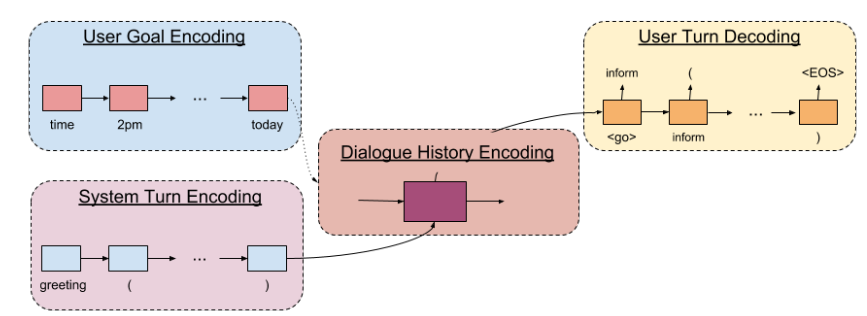

在 [ConvLab2 01. Agenda-based User Simulator](https://loveychen.github.io/2021/04/14/intro-convlab2-user-simulator-agenda/) 中, 我们介绍了基于 Agenda 的用户模拟器. 

今天我们来介绍一个基于神经网络的端到端的用户模拟器: HUS.

HUS, 全称 **H**ierarchical **U**ser **S**imulator, 是 2018 年 Izzeddin Gur, Dilek Hakkani-Tur, Gokhan Tur, Pararth Shah 等人在论文 [User Modeling for Task Oriented Dialogues](https://arxiv.org/abs/1811.04369) 提出的用户模拟器. 当时4位作者都在 Google AI 工作.

# User Modeling for Task Oriented Dialogues

任务型对话系统(Task Oriented Dialogue System, 简称 TOD) 是以人机交互的形式帮助用户完成目标 (accomplish their goal). 

从TOD 架构上看, 可以将 TOD 的研究划分为两大类:

* Pipeline architecture
* end-to-end architecture

在 TOD 中, User Simulator 主要用于对话系统(或其各个模块) 的评估和训练. 整体而言, User Simulator 主要作用有:

* 辅助训练 TOD. 如 Asri et al [^1], Baolin Peng et al [^2] 及 Paul Crook et al [^3] 等实验了使用 seq2seq 模型构建的用户模拟器来训练 Dialogue Policy 模型
* 辅助评估 TOD. 使用 Simulator 模拟用户与 TOD 交互, 可以得到 User Goal 的 EM (Exact Matching) 和 PM (Partial Matching) 指标等.

HUS 是 User Simulator 的一种, 它借鉴了端到端 TOD 的设计思想, 也提供了一种端到端的 User Simulator. 具体地, HUS 利用了如下这些技术:

* seq2seq
* hierarchical model
* variational method
* goal regularization approach

## seq2seq

seq2seq 是 2014 年 Google 的 Ilya Sutskever, Oriol Vinyals 及 Quoc Viet Le 等人在论文 [Sequence to Sequence Learning with Neural Network](http://arxiv.org/abs/1409.3215) 中提出的一种序列生成模型, 可以用在 NMT, NLG, QA 等多个 NLP 领域.

几乎在同一时期 (事实上比 Seq2seq 更早一些), Kyunghyun Cho, Dzmitry Bahdanau, Fethi Bougares, Holger Schwenk, Yoshua Bengio 等人在论文 [Learning Phrase Representations using RNN Encoder-Decoder for Statistical Machine Translation](http://arxiv.org/abs/1406.1078) 中提出了 Encoder-Decoder 框架.

两篇论文采用了相似的系统架构, 不同点在于 Encoder-Decoder 论文使用了 GRU (当时论文中还没有称之为 GRU), 而 Seq2seq 则使用了 LSTM.

一般地, 除了特别声明, 我们认为 seq2seq 与 Encoder-Decoder 架构是同义词.

## hierarchical model

Hierarchical model 指的是, 相关研究有:

* [A Hierarchical Neural Autoencoder for Paragraphs and Documents](http://aclweb.org/anthology/P15-1107), Jiwei Li, Minh-Thang Luong, and Dan Jurafsky, CoRR, vol. abs/1506.01057, 2015.
* [A Hierarchical Recurrent Encoder-Decoder For Generative Context-Aware Query Suggestion](https://arxiv.org/abs/1507.02221), Alessandro Sordoni, Yoshua Bengio, Hossein Vahabi, Christina Lioma, Jakob Grue Simonsen, and Jian-Yun Nie, CoRR, vol. abs/1507.02221, 2015.
* [A hierarchical latent variable encoder-decoder model for generating dialogues](http://arxiv.org/abs/1605.06069), Iulian Vlad Serban, Alessandro Sordoni, Ryan Lowe, Laurent Charlin, Joelle Pineau, Aaron C. Courville, and Yoshua Ben- gio, CoRR, vol. abs/1605.06069, 2016.

> [hierarchical](https://www.collinsdictionary.com/dictionary/english/hierarchical), "按等级划分的; 等级制度的; 分层的; 分等级的"
> 1. [adj] A hierarchical system or organization is one in which people have different ranks or positions,depending on how important they are.
> 
> `hierarchical` 由 `hierarch` + 形容词后缀 `-ical` 构成.
> `hierarch` 来源于希腊词汇 `hierarkhia`, 含义是 "one who rules in holy things" ("大主教; 祭司长; 统治集团首领").

Hierarchical Model 也称为 [Multi-Level model](https://en.wikipedia.org/wiki/Multilevel_model), 最常用的有:

* Hierarchical Linear Model, 层次线性模型 (HLM)
* [Hierarchical Bayesian Model](https://en.wikipedia.org/wiki/Bayesian_network), 层次贝叶斯模型, 也称为贝叶斯网络
* Hierarchical Neural Network, 层次神经网络

层级模型使用了多个模型, 数据会先由底层模型处理, 其处理结果作为高层模型的输入特征进一步处理, 多级模型协作并联合训练.

HUS 中使用了

## variational method

Variational Method / Variational Approach, 一般翻译为 "差分法; 变分法", 在机器学习/深度学习模型中的典型使用是 Variational Auto-Encoder, 如:

* [Auto-Encoding Variational Bayes](https://arxiv.org/abs/1312.6114), Diederik P Kingma, Max Welling, 2013
* [Variational Recurrent Auto-Encoders](https://arxiv.org/abs/1412.6581), Otto Fabius, Joost R. van Amersfoort, 2014

## HUS

在开始正式介绍 HUS 之前, 再次介绍一下 User Simulator 中的一些基本概念.

User Simulator 建模可以认为是 Dialogue System 的逆问题 (inverse problem), 其目标是根据 User Goal 和 系统响应 System Turn (*可以是 System Action (Pipeline 架构), 也可以是 System Utterance (E2E 架构)*) 来生成合适的 User Turn.

这里 User Goal $C$ 是一个 $<slot, value>$ 集合 及 一组预定义的用户个性 (User Personality, *可以是 `aggressive` / `cooperative` 等描述性词语, 也可以是自然语言描述的段落* ).

System Turn / User Turn 一般使用 Dialogue Action 来描述. Dialogue Action 可以表示为一组 $<domain, intent, slot, value>$ 构成的集合 (*当处理 single domain 对话时, 可以省略 `domain` 元素*).

> **问题简化**
> HUS 将 Slot Value 简化为 $\{Requested, DontCare, ValueInGoal, ValueContradictsGoal, Other\}$ 五个值.

> **数据序列化问题**
> User Simulator 的部分输入数据是结构化数据, 如 User Goal / System Action 等, 需要使用一定的方法将这些结构化数据编码为序列. 论文使用了 [Grammar as a foreign language, 2014](https://arxiv.org/abs/1412.7449) 给出的序列化方法, System Action `confirm(movie=ValueInGoal, time=ValueInGoal)` 会被序列化为 `"confirm", "(", "movie=ValueInGoal", "time=ValueInGoal", ")"` 序列.

基于上述概念, User Simulator 的形式化建模如下:

$$
U_t = \text{Simulator}(C, S_{1:t})
$$

即在给定 User Goal $C$ 和 System Turn 序列 $S_{1:t}$ 的条件下, 生成合适的 User Turn $U_t$.

### HUS 基础模型

HUS 基础模型主要由四部分构成

* User Goal Encoding
* System Turn Encoding
* Dialogue History Encoding
* User Turn Decoding

其结构如下图所示

<!--  -->

#### 层级编码器 

对于序列化后的 User Goal $G$, 首先会经过一个 Embedding 层得到序列向量 $e^{G}$, 然后经过 User Goal Encoder, 得到 User Goal 的隐层表示 $h^C$, 即:

$$
h^C = \text{Goal-Encoder}(e^C; \theta^{C})
$$

同理, 第 t 轮的 System Turn 可以得到隐层表示 $h^S$, 即:

$$
h_t^S = \text{System-Encoder}(e_t^S; \theta^{S})
$$

结合 $h^C$ 及 $h_t^S$, 使用 Dialogue History Encoder 可以得到 Dialogue History 的隐层表示, 即:

$$
\begin{aligned}
h_0^D &= h^C \\
h_t^D &= \text{History-Encoder}(h_{1:t}^S; \theta^{D})
\end{aligned}
$$

#### User Turn 解码器

HUS 使用了一个 RNN 来解码 User Turn, 第 t 轮的 User Turn 解码过程如下:

$$
\begin{aligned}
h_0^U &= h_t^D \\
h_{t, i} ^ U &= \text{Decoder} (h_{t-1, i}^U; \theta^{U}) \\
P(U_{t, i}^{*})  & \approx \text{softmax} (W^u * h_{t, i}^U + b^U) \\
U_{t, i} &= \text{argmax}_{w_j \in V} P(U_{t, i}^{*})
\end{aligned}
$$

### HUS 优化模型

#### VHUS

#### UHUSReg

# ConvLab2 实现

# 参考文献

[^1]: Layla El Asri, Jing He, and Kaheer Suleman, ["A sequence-to-sequence model for user simulation in spoken dialogue system"](https://arxiv.org/abs/1607.00070), CoRR, vol. abs/1607.00070, 2016
[^2]: Baolin Peng, Xiujun Li, Lihong Li, Jianfeng Gao, Asli Celiky- ilmaz, Sungjin Lee, and Kam-Fai Wong, ["Composite task-completion dialogue system via hierarchical deep reinforcement learning"](https://arxiv.org/abs/1704.03084), arxiv:1704.03084v2, 2017.
[^3]: Paul Crook and Alex Marin, ["Sequence to sequence modeling for user simulation in dialog systems"](), in Proceedings of the 18th Annual Conference of the International Speech Commu- nication Association (INTERSPEECH 2017), 2017, pp. 1706– 1710.
